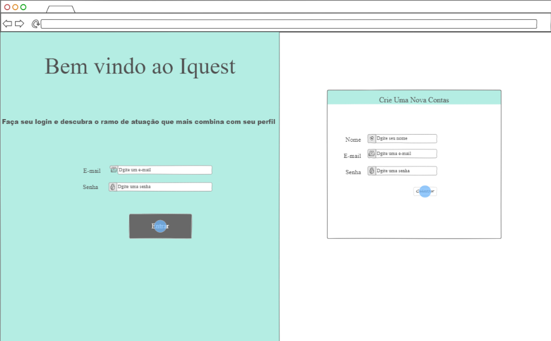
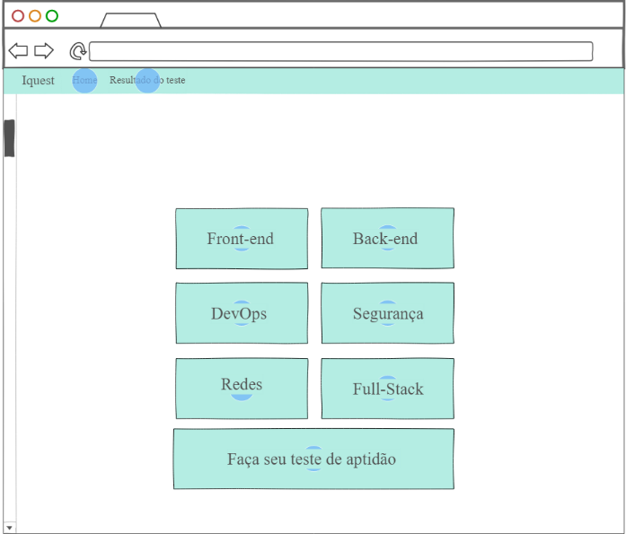
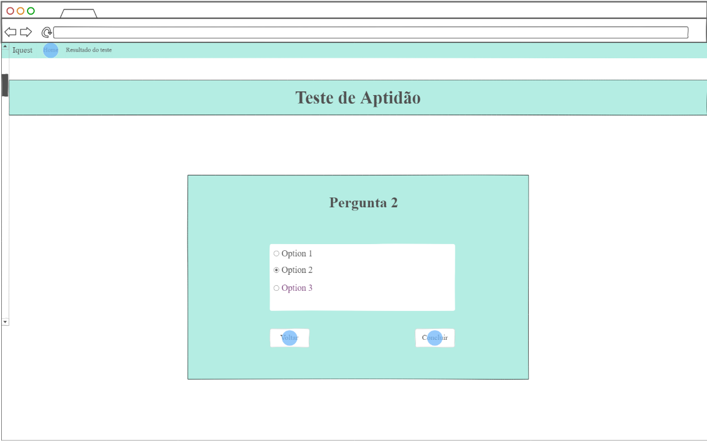
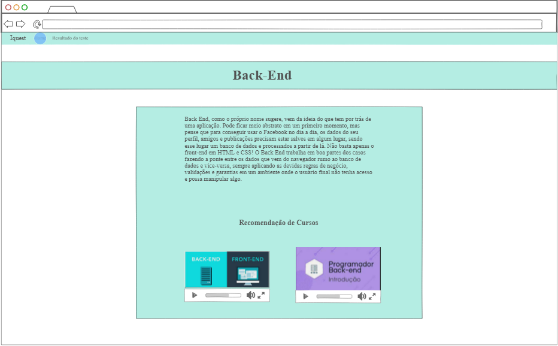
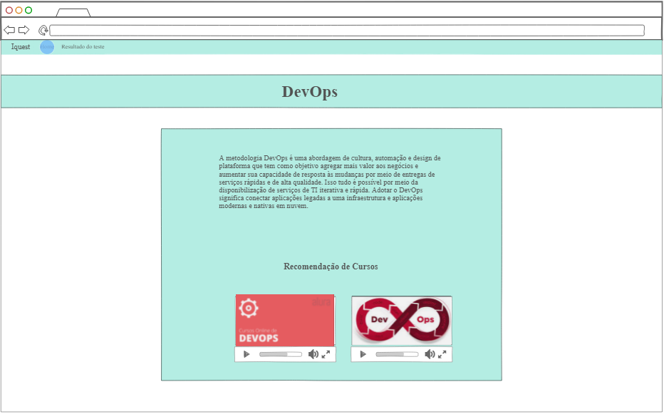
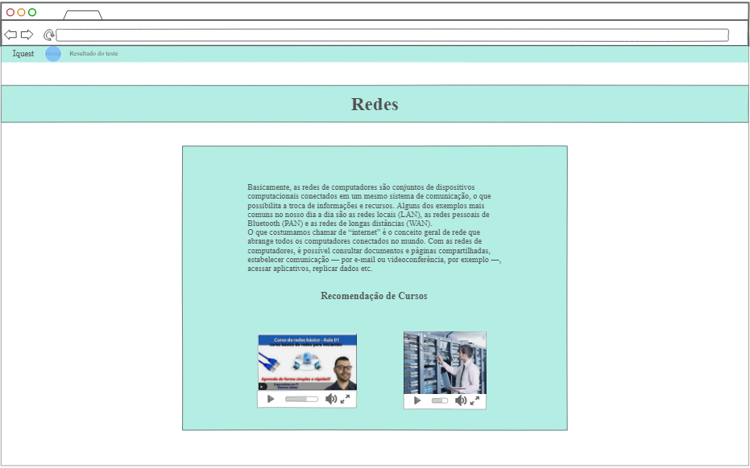
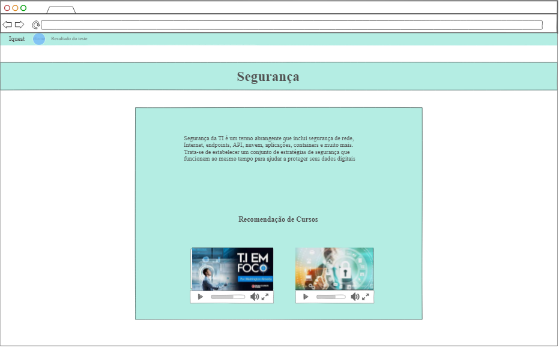

# Informações do Projeto
`Iquest`  

O Iquest é um projeto de um site voltado a um guia de carreira para as áreas relacionadas à tecnologia e ao sistema de informações, onde o através desse mecanismo o usuário fará um quiz que traçara o perfil comportamental e como retorno lhe será indicado áreas de trabalho compatíveis com suas respostas e trazendo também um cronograma de iniciação e estudo da área. 

`SISTEMAS DE INFORMAÇÃO` 

## Participantes

> Os membros do grupo são: 
> - Kaiky Leles 
> - Thiago Lacerda
> - Ícaro Starling
> - Jeziel Suzana
> - Gustavo Antônio

# Estrutura do Documento

- [Informações do Projeto](#informações-do-projeto)
  - [Participantes](#participantes)
- [Estrutura do Documento](#estrutura-do-documento)
- [Introdução](#introdução)
  - [Problema](#problema)
  - [Objetivos](#objetivos)
  - [Justificativa](#justificativa)
  - [Público-Alvo](#público-alvo)
- [Especificações do Projeto](#especificações-do-projeto)
  - [Personas e Mapas de Empatia](#personas-e-mapas-de-empatia)
  - [Histórias de Usuários](#histórias-de-usuários)
  - [Requisitos](#requisitos)
    - [Requisitos Funcionais](#requisitos-funcionais)
    - [Requisitos não Funcionais](#requisitos-não-funcionais)
  - [Restrições](#restrições)
- [Projeto de Interface](#projeto-de-interface)
  - [User Flow](#user-flow)
  - [Wireframes](#wireframes)
- [Metodologia](#metodologia)
  - [Divisão de Papéis](#divisão-de-papéis)
  - [Ferramentas](#ferramentas)
  - [Controle de Versão](#controle-de-versão)
- [**############## SPRINT 1 ACABA AQUI #############**](#-sprint-1-acaba-aqui-)
- [Projeto da Solução](#projeto-da-solução)
  - [Tecnologias Utilizadas](#tecnologias-utilizadas)
  - [Arquitetura da solução](#arquitetura-da-solução)
- [Avaliação da Aplicação](#avaliação-da-aplicação)
  - [Plano de Testes](#plano-de-testes)
  - [Ferramentas de Testes (Opcional)](#ferramentas-de-testes-opcional)
  - [Registros de Testes](#registros-de-testes)
- [Referências](#referências)

# Introdução

## Problema

A tecnologia da informação possui uma gama de possibilidades muito alta, gerando assim, duvidas em quais áreas ingressar. Pensando nisso o Iquest veio ao mercado para sanar essas dúvidas e ajudar na iniciação da área traçada através do perfil comportamental. 

## Objetivos

- Ajudar na escolha de uma das diversas áreas da tecnologia da informação.
- Traçar um perfil através de escolhas.
- Ajudar na iniciação de estudos.
- Fornecer especialização para o usuário. 

## Justificativa

Vendo as duvidas dos usuarios quanto a questao era saber por onde começar, vemos uma importancia de sanar essa duvida. E por isso surgiu o Iquest que tem como maior justificativa sanar duvida de novos estudantes que sonham em ingressar na área de TI. Além disso, a partir das entrevistas apresentadas no documento de Design Thinking foi possível comprovar que o Iquest seria uma solução ideal para os problemas relatados pelos estudantes.

## Público-Alvo

Pessoas que estão ingressando na área de TI e possuem dúvida por onde começar.
 
# Especificações do Projeto

Neste documento serão apresentados os aspectos relevantes para o desenvolvimento do Iquest, como a Persona, as funcionalidades do site responsável por resolver o problema, juntamento com o Wireframe de telas demonstrando como o site será visualmente.

## Personas e Mapas de Empatia

......  COLOQUE AQUI O SEU TEXTO ......

> 
> 

> Relacione as personas identificadas no seu projeto e os respectivos mapas de empatia. Lembre-se que 
> você deve ser enumerar e descrever precisamente e de forma
> personalizada todos os principais envolvidos com a solução almeja. 
> 
> Para tanto, baseie-se tanto nos documentos disponibilizados na disciplina
> e/ou nos seguintes links:
>
> **Links Úteis**:
> - [Persona x Público-alvo](https://flammo.com.br/blog/persona-e-publico-alvo-qual-a-diferenca/)
> - [O que é persona?](https://resultadosdigitais.com.br/blog/persona-o-que-e/)
> - [Rock Content](https://rockcontent.com/blog/personas/)
> - [Hotmart](https://blog.hotmart.com/pt-br/como-criar-persona-negocio/)
> - [Mapa de Empatia](https://resultadosdigitais.com.br/blog/mapa-da-empatia/)
> - [Como fazer um mapa de empatia - Vídeo](https://www.youtube.com/watch?v=JlKHGpVoA2Y)
> 
> 
> **Exemplo de Persona**
> 
> 
> 
> Fonte: [Como criar uma persona para o seu negócio](https://raissaviegas.com.br/como-criar-uma-persona/)

## Histórias de Usuários

Com base na análise das personas forma identificadas as seguintes histórias de usuários:

|EU COMO... `PERSONA`| QUERO/PRECISO ... `FUNCIONALIDADE` |PARA ... `MOTIVO/VALOR`                 |
|--------------------|------------------------------------|----------------------------------------|
|Usuário do sistema  | Registrar minhas tarefas           | Não esquecer de fazê-las               |
|Administrador       | Alterar permissões                 | Permitir que possam administrar contas |

> Apresente aqui as histórias de usuário que são relevantes para o
> projeto de sua solução. As Histórias de Usuário consistem em uma
> ferramenta poderosa para a compreensão e elicitação dos requisitos
> funcionais e não funcionais da sua aplicação. Se possível, agrupe as
> histórias de usuário por contexto, para facilitar consultas
> recorrentes à essa parte do documento.
>
> **Links Úteis**:
> - [Histórias de usuários com exemplos e template](https://www.atlassian.com/br/agile/project-management/user-stories)
> - [Como escrever boas histórias de usuário (User Stories)](https://medium.com/vertice/como-escrever-boas-users-stories-hist%C3%B3rias-de-usu%C3%A1rios-b29c75043fac)

## Requisitos

As tabelas que se seguem apresentam os requisitos funcionais e não funcionais que detalham o escopo do projeto.

### Requisitos Funcionais

|ID    | Descrição do Requisito  | Prioridade |
|------|-----------------------------------------|----|
|RF-001| O usuário acessa o site com um login e senha | MÉDIA | 
|RF-002| O site deve ter uma análise de comportamento para indicar o curso | ALTA |
|RF-003| O site retorna a área compatível com as respostas do usuário | ALTA |
|RF-004| O site deve ter uma análise de comportamento para indicar o curso | ALTA |
|RF-005| O site retorna um fluxo de estudo de acordo com os cursos compatíveis com a área | MÉDIA |

### Requisitos não Funcionais

|ID     | Descrição do Requisito  |Prioridade |
|-------|-------------------------|----|
|RNF-001| Organização das respostas tornando mais interativo. | MÉDIA | 
|RNF-002| Sequencia logica das perguntas |  MÉDIA | 
|RNF-003| Validação imediata das respostas |  ALTA | 
|RNF-004| O site deve organizar o fluxo de estudo para facilitar a interpretação |  MÉDIA | 

## Restrições

O projeto está restrito pelos itens apresentados na tabela a seguir.

|ID| Restrição                                             |
|--|-------------------------------------------------------|
|01| O projeto deverá ser entregue até o final do semestre |
|02| O projeto deve estar pronto em 3 meses |
|03| O Projeto deve atentar a lei geral de proteção de dados |
|04| O Projeto tem que dar créditos aos professores dos cursos |

# Projeto de Interface

......  COLOQUE AQUI O SEU TEXTO DE INTRODUÇÃO ......

> Apresente as principais interfaces da solução. Discuta como 
> foram elaboradas de forma a atender os requisitos funcionais, não
> funcionais e histórias de usuário abordados nas [Especificações do
> Projeto](#especificações-do-projeto).

## Wireframes e User Flow

### Home

### Tela Inicial

### Teste Aptidão

### Front-End

### Back-End

### Full-Stack

### DevOps

### Redes

### Segurança

# Metodologia

......  COLOQUE AQUI O SEU TEXTO ......

> Nesta parte do documento, você deve apresentar a metodologia 
> adotada pelo grupo, descrevendo o processo de trabalho baseado nas metodologias ágeis, 
> a divisão de papéis e tarefas, as ferramentas empregadas e como foi realizada a
> gestão de configuração do projeto via GitHub.
>
> Coloque detalhes sobre o processo de Design Thinking e a implementação do Framework Scrum seguido
> pelo grupo. O grupo poderá fazer uso de ferramentas on-line para acompanhar
> o andamento do projeto, a execução das tarefas e o status de desenvolvimento
> da solução.

## Divisão de Papéis

Os papéis foram dividos a partir do trello e focados em 2 partes, os membros focados na parte do front-end do site e a outra parte no back-end do site.

| Membro  | Papel              |
|-----------|-------------------------|
|Samuel Lamera| Teste/Full-Stack | 
|Jeziel Suzana| Teste/Front-End | 
|Kaiky Leles| Teste/Front-End |  
|Ícaro Starling| Teste/Back-End |
|Thiago Lacerda| Teste/Back-End | 
|Gustavo Antonio | Teste/Back-End | 

## Ferramentas

As ferramentas empregadas no projeto são:

| Ambiente  | Plataforma              |Link de Acesso |
|-----------|-------------------------|---------------|
|Processo de Design Thinkgin  | Draw.io |  https://app.diagrams.net/ | 
|Repositório de código | GitHub | https://github.com/ | 
|Hospedagem do site | Hostinger |  https://www.hostinger.com.br/ | 
|Protótipo Interativo | NinjaMock| https://ninjamock.com/ | 
|Desenvolvimento| VsCode| https://code.visualstudio.com/ | 

- O draw.io foi escolhido pela sua simplicidade em construir fluxos.
- Github por ser uma plataforma de hospedagem de código-fonte e arquivos com controle de versão usando o Git mais conhecida por todos os participantes.
- Hostinger para hospedagem do site por ser o mais barato e simples de utilizar.
- NijaMock para Protótipo Interativo, pois, um dos participantes ja utilizou uma vez e tinha familiariedade.
- VsCode para desenvolvimento por ser o que todos mais utilizam.

## Controle de Versão

......  COLOQUE AQUI O SEU TEXTO ......

> Discuta como a configuração do projeto foi feita na ferramenta de
> versionamento escolhida. Exponha como a gerência de tags, merges,
> commits e branchs é realizada. Discuta como a gerência de issues foi
> realizada.
> A ferramenta de controle de versão adotada no projeto foi o
> [Git](https://git-scm.com/), sendo que o [Github](https://github.com)
> foi utilizado para hospedagem do repositório `upstream`.
> 
> O projeto segue a seguinte convenção para o nome de branchs:
> 
> - `master`: versão estável já testada do software
> - `unstable`: versão já testada do software, porém instável
> - `testing`: versão em testes do software
> - `dev`: versão de desenvolvimento do software
> 
> Quanto à gerência de issues, o projeto adota a seguinte convenção para
> etiquetas:
> 
> - `bugfix`: uma funcionalidade encontra-se com problemas
> - `enhancement`: uma funcionalidade precisa ser melhorada
> - `feature`: uma nova funcionalidade precisa ser introduzida
>
> **Links Úteis**:
> - [Tutorial GitHub](https://guides.github.com/activities/hello-world/)
> - [Git e Github](https://www.youtube.com/playlist?list=PLHz_AreHm4dm7ZULPAmadvNhH6vk9oNZA)
> - [5 Git Workflows & Branching Strategy to deliver better code](https://zepel.io/blog/5-git-workflows-to-improve-development/)
>
> **Exemplo - GitHub Feature Branch Workflow**:
>
> 

# **############## SPRINT 1 ACABA AQUI #############**

# Projeto da Solução

......  COLOQUE AQUI O SEU TEXTO ......

## Tecnologias Utilizadas

......  COLOQUE AQUI O SEU TEXTO ......

> Descreva aqui qual(is) tecnologias você vai usar para resolver o seu
> problema, ou seja, implementar a sua solução. Liste todas as
> tecnologias envolvidas, linguagens a serem utilizadas, serviços web,
> frameworks, bibliotecas, IDEs de desenvolvimento, e ferramentas.
> Apresente também uma figura explicando como as tecnologias estão
> relacionadas ou como uma interação do usuário com o sistema vai ser
> conduzida, por onde ela passa até retornar uma resposta ao usuário.
> 
> Inclua os diagramas de User Flow, esboços criados pelo grupo
> (stoyboards), além dos protótipos de telas (wireframes). Descreva cada
> item textualmente comentando e complementando o que está apresentado
> nas imagens.

## Arquitetura da solução

......  COLOQUE AQUI O SEU TEXTO E O DIAGRAMA DE ARQUITETURA .......

> Inclua um diagrama da solução e descreva os módulos e as tecnologias
> que fazem parte da solução. Discorra sobre o diagrama.
> 
> **Exemplo do diagrama de Arquitetura**:
> 
> 

# Avaliação da Aplicação

......  COLOQUE AQUI O SEU TEXTO ......

> Apresente os cenários de testes utilizados na realização dos testes da
> sua aplicação. Escolha cenários de testes que demonstrem os requisitos
> sendo satisfeitos.

## Plano de Testes

......  COLOQUE AQUI O SEU TEXTO ......

> Enumere quais cenários de testes foram selecionados para teste. Neste
> tópico o grupo deve detalhar quais funcionalidades avaliadas, o grupo
> de usuários que foi escolhido para participar do teste e as
> ferramentas utilizadas.
> 
> **Links Úteis**:
> - [IBM - Criação e Geração de Planos de Teste](https://www.ibm.com/developerworks/br/local/rational/criacao_geracao_planos_testes_software/index.html)
> - [Práticas e Técnicas de Testes Ágeis](http://assiste.serpro.gov.br/serproagil/Apresenta/slides.pdf)
> -  [Teste de Software: Conceitos e tipos de testes](https://blog.onedaytesting.com.br/teste-de-software/)

## Ferramentas de Testes (Opcional)

......  COLOQUE AQUI O SEU TEXTO ......

> Comente sobre as ferramentas de testes utilizadas.
> 
> **Links Úteis**:
> - [Ferramentas de Test para Java Script](https://geekflare.com/javascript-unit-testing/)
> - [UX Tools](https://uxdesign.cc/ux-user-research-and-user-testing-tools-2d339d379dc7)

## Registros de Testes

......  COLOQUE AQUI O SEU TEXTO ......

> Discorra sobre os resultados do teste. Ressaltando pontos fortes e
> fracos identificados na solução. Comente como o grupo pretende atacar
> esses pontos nas próximas iterações. Apresente as falhas detectadas e
> as melhorias geradas a partir dos resultados obtidos nos testes.

# Referências

......  COLOQUE AQUI O SEU TEXTO ......

> Inclua todas as referências (livros, artigos, sites, etc) utilizados
> no desenvolvimento do trabalho.
> 
> **Links Úteis**:
> - [Formato ABNT](https://www.normastecnicas.com/abnt/trabalhos-academicos/referencias/)
> - [Referências Bibliográficas da ABNT](https://comunidade.rockcontent.com/referencia-bibliografica-abnt/)
